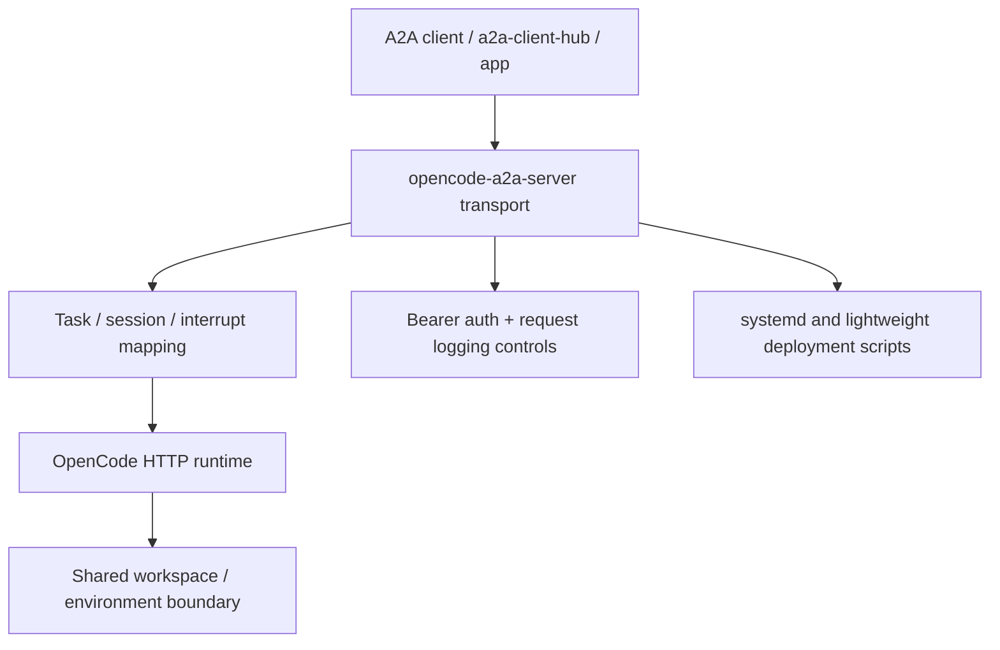

# opencode-a2a-server

> Turn OpenCode into a stateful A2A service with a clear runtime boundary and production-friendly deployment workflow.

`opencode-a2a-server` exposes OpenCode through standard A2A interfaces and adds
the operational pieces that raw agent runtimes usually do not provide by
default: authentication, session continuity, streaming contracts, interrupt
handling, deployment tooling, and explicit security guidance.

## Why This Project Exists

OpenCode is useful as an interactive runtime, but applications and gateways
need a stable service layer around it. This repository provides that layer by:

- bridging A2A transport contracts to OpenCode session/message/event APIs
- making session and interrupt behavior explicit and auditable
- packaging deployment scripts and operational guidance for long-running use

## What It Already Provides

- A2A HTTP+JSON endpoints (`/v1/message:send`, `/v1/message:stream`,
  `GET /v1/tasks/{task_id}:subscribe`)
- A2A JSON-RPC endpoint (`POST /`) for standard methods and OpenCode-oriented
  extensions
- SSE streaming with normalized `text`, `reasoning`, and `tool_call` blocks
- session continuation via `metadata.shared.session.id`
- request-scoped model selection via `metadata.shared.model`
- OpenCode session query/control extensions and provider/model discovery
- systemd multi-instance deployment and lightweight current-user deployment

## Extension Capability Overview

The Agent Card declares six extension URIs. Shared contracts are intended for
any compatible consumer; OpenCode-specific contracts stay provider-scoped even
though they are exposed through A2A JSON-RPC.

| Extension URI | Scope | Primary use |
| --- | --- | --- |
| `urn:a2a:session-binding/v1` | Shared | Bind a main chat request to an existing upstream session via `metadata.shared.session.id` |
| `urn:a2a:model-selection/v1` | Shared | Override the default upstream model for one main chat request |
| `urn:a2a:stream-hints/v1` | Shared | Advertise canonical stream metadata for blocks, usage, interrupts, and session hints |
| `urn:opencode-a2a:session-query/v1` | OpenCode-specific | Query external sessions and invoke OpenCode session control methods |
| `urn:opencode-a2a:provider-discovery/v1` | OpenCode-specific | Discover normalized OpenCode provider/model summaries |
| `urn:a2a:interactive-interrupt/v1` | Shared | Reply to interrupt callbacks observed from stream metadata |

Detailed consumption guidance:

- Shared session binding: [`docs/guide.md#shared-session-binding-contract`](docs/guide.md#shared-session-binding-contract)
- Shared model selection: [`docs/guide.md#shared-model-selection-contract`](docs/guide.md#shared-model-selection-contract)
- Shared stream hints: [`docs/guide.md#shared-stream-hints-contract`](docs/guide.md#shared-stream-hints-contract)
- OpenCode session query and provider discovery: [`docs/guide.md#opencode-session-query--provider-discovery-a2a-extensions`](docs/guide.md#opencode-session-query--provider-discovery-a2a-extensions)
- Shared interrupt callback: [`docs/guide.md#shared-interrupt-callback-a2a-extension`](docs/guide.md#shared-interrupt-callback-a2a-extension)

## Design Principle: Single-Tenant Self-Deployment

One `OpenCode + opencode-a2a-server` instance pair is treated as a
single-tenant trust boundary. This project supports **parameterized
self-deployment**, allowing consumers to spin up their own isolated instance
pairs programmatically.

- **Autonomous Deployment Contract:** Both `deploy.sh` and `deploy_light.sh`
  follow a machine-readable contract for input validation, readiness checking,
  and status reporting.
- **Isolation by Instance:** OpenCode may manage multiple projects, but one
  deployed instance is not a secure multi-tenant runtime.
- **Consumption Strategy:** For mutually untrusted tenants, consumers should
  trigger separate deployment cycles with unique ports, isolated Linux users (via
  `deploy.sh`), or isolated workspace roots.

Logical Components:



This repository wraps OpenCode in a service layer. It does not change OpenCode
into a hard multi-tenant isolation platform.

## Recommended Client Side

If you need a client-side integration layer to consume this service, prefer
[a2a-client-hub](https://github.com/liujuanjuan1984/a2a-client-hub).

It is a better place for client concerns such as A2A consumption, upstream
adapter normalization, and application-facing integration, while
`opencode-a2a-server` stays focused on the server/runtime boundary around
OpenCode.

## Security Model

This project improves the service boundary around OpenCode, but it is not a
hard multi-tenant isolation layer.

- `A2A_BEARER_TOKEN` protects the A2A surface, but it is not a tenant
  isolation boundary inside one deployed instance.
- LLM provider keys are consumed by the OpenCode process. Prompt injection or
  indirect exfiltration attempts may still expose sensitive values.
- systemd deploy defaults use operator-provisioned root-only secret files
  unless `ENABLE_SECRET_PERSISTENCE=true` is explicitly enabled.

Read before deployment:

- [SECURITY.md](SECURITY.md)
- [scripts/deploy_readme.md](scripts/deploy_readme.md)

## Quick Start & Development

1. Start OpenCode:

```bash
opencode serve
```

2. Install dependencies:

```bash
uv sync --all-extras
```

3. Start this service:

```bash
A2A_BEARER_TOKEN=dev-token uv run opencode-a2a-server
```

Default address: `http://127.0.0.1:8000`

Baseline validation:

```bash
uv run pre-commit run --all-files
uv run pytest
```

## Documentation Map

- [docs/guide.md](docs/guide.md)
  Product behavior, API contracts, and detailed streaming/session/interrupt
  consumption guidance.
- [docs/agent_deploy_sop.md](docs/agent_deploy_sop.md)
  Operator-facing SOP for choosing, starting, verifying, and releasing
  `deploy.sh` vs `deploy_light.sh`.
- [scripts/README.md](scripts/README.md)
  Entry points for init, deploy, lightweight deploy, local start, and
  uninstall scripts.
- [scripts/deploy_readme.md](scripts/deploy_readme.md)
  systemd deployment, runtime secret strategy, and operations guidance.
- [scripts/deploy_light_readme.md](scripts/deploy_light_readme.md)
  current-user lightweight deployment without systemd.
- [SECURITY.md](SECURITY.md)
  threat model, deployment caveats, and vulnerability disclosure guidance.

## License

Apache-2.0. See [`LICENSE`](LICENSE).
