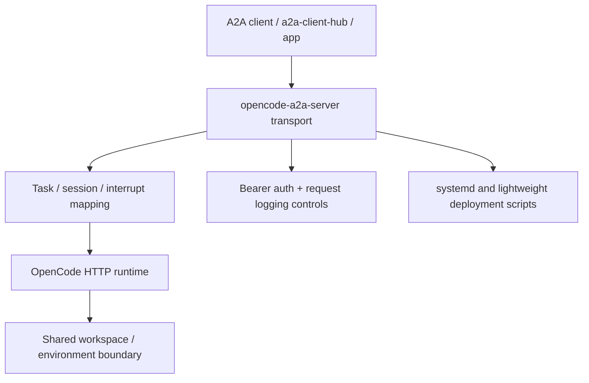

# opencode-a2a-server

> Turn OpenCode into a stateful A2A service with a clear runtime boundary and production-friendly deployment workflow.

`opencode-a2a-server` exposes OpenCode through standard A2A interfaces and adds
the operational pieces that raw agent runtimes usually do not provide by
default: authentication, session continuity, streaming contracts, interrupt
handling, deployment tooling, and explicit security guidance.

## Why This Project Exists

OpenCode is useful as an interactive runtime, but applications and gateways
need a stable service layer around it. This repository provides that layer by:

- bridging A2A transport contracts to OpenCode session/message/event APIs
- making session and interrupt behavior explicit and auditable
- packaging deployment scripts and operational guidance for long-running use

## What It Already Provides

- A2A HTTP+JSON endpoints (`/v1/message:send`, `/v1/message:stream`,
  `GET /v1/tasks/{task_id}:subscribe`)
- A2A JSON-RPC endpoint (`POST /`) for standard methods and OpenCode-oriented
  extensions
- SSE streaming with normalized `text`, `reasoning`, and `tool_call` blocks
- session continuation via `metadata.shared.session.id`
- request-scoped model selection via `metadata.shared.model`
- OpenCode session query/control extensions and provider/model discovery
- systemd multi-instance deployment and lightweight current-user deployment

## Design Principle

One `OpenCode + opencode-a2a-server` instance pair is treated as a
single-tenant trust boundary.

- OpenCode may manage multiple projects/directories, but one deployed instance
  is not a secure multi-tenant runtime.
- Shared-instance identity/session checks are best-effort coordination, not
  hard tenant isolation.
- For mutually untrusted tenants, deploy separate instance pairs with isolated
  Linux users or containers, isolated workspace roots, and isolated
  credentials.

## Logical Components



This repository wraps OpenCode in a service layer. It does not change OpenCode
into a hard multi-tenant isolation platform.

## Recommended Client Side

If you need a client-side integration layer to consume this service, prefer
[a2a-client-hub](https://github.com/liujuanjuan1984/a2a-client-hub).

It is a better place for client concerns such as A2A consumption, upstream
adapter normalization, and application-facing integration, while
`opencode-a2a-server` stays focused on the server/runtime boundary around
OpenCode.

## Security Model

This project improves the service boundary around OpenCode, but it is not a
hard multi-tenant isolation layer.

- `A2A_BEARER_TOKEN` protects the A2A surface, but it is not a tenant
  isolation boundary inside one deployed instance.
- LLM provider keys are consumed by the OpenCode process. Prompt injection or
  indirect exfiltration attempts may still expose sensitive values.
- systemd deploy defaults use operator-provisioned root-only secret files
  unless `ENABLE_SECRET_PERSISTENCE=true` is explicitly enabled.

Read before deployment:

- [SECURITY.md](SECURITY.md)
- [scripts/deploy_readme.md](scripts/deploy_readme.md)

## Quick Start & Development

1. Start OpenCode:

```bash
opencode serve
```

2. Install dependencies:

```bash
uv sync --all-extras
```

3. Start this service:

```bash
A2A_BEARER_TOKEN=dev-token uv run opencode-a2a-server
```

Default address: `http://127.0.0.1:8000`

Baseline validation:

```bash
uv run pre-commit run --all-files
uv run pytest
```

## Documentation Map

- [docs/guide.md](docs/guide.md)
  Product behavior, API contracts, streaming/session/interrupt details.
- [scripts/README.md](scripts/README.md)
  Entry points for init, deploy, lightweight deploy, local start, and
  uninstall scripts.
- [scripts/deploy_readme.md](scripts/deploy_readme.md)
  systemd deployment, runtime secret strategy, and operations guidance.
- [scripts/deploy_light_readme.md](scripts/deploy_light_readme.md)
  current-user lightweight deployment without systemd.
- [SECURITY.md](SECURITY.md)
  threat model, deployment caveats, and vulnerability disclosure guidance.

## License

Apache-2.0. See [`LICENSE`](LICENSE).
